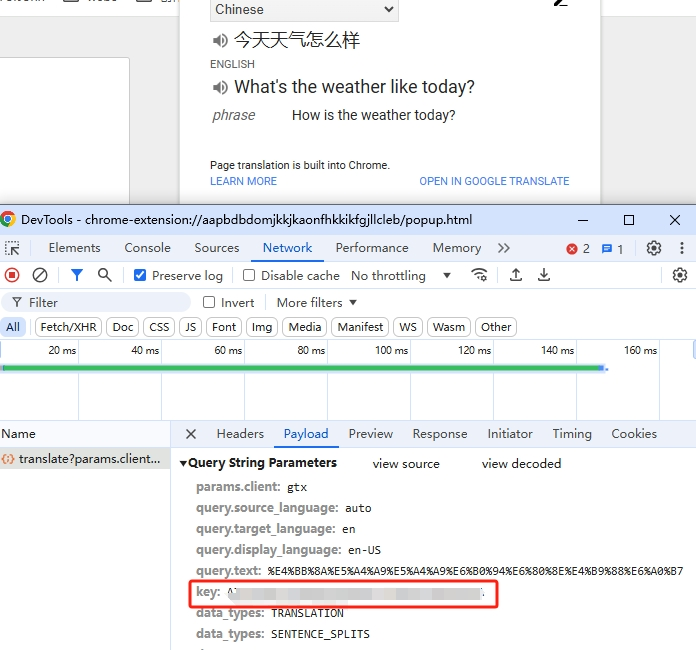

# Google translate API

## Google Translate and Text-to-Speech Integration in Python
This Python script demonstrates how to integrate Google Translate and Text-to-Speech (TTS) services to translate text and generate corresponding audio files.

## Features
- **Text Translation**: Translate text from a source language to a target language using Google Translate API.
- **Text-to-Speech**: Convert translated text into speech and save it as an MP3 file.

## Prerequisites

- **Python 3.6+:** Ensure that Python is installed on your system.
- **Environment Variables:** Store your API key in an environment variable named TRANSLATE_KEY.
    - The key from chrome extension named: [Google 翻译](https://chromewebstore.google.com/detail/google-translate/aapbdbdomjkkjkaonfhkkikfgjllcleb)

    - Screenshots
    
    

    
